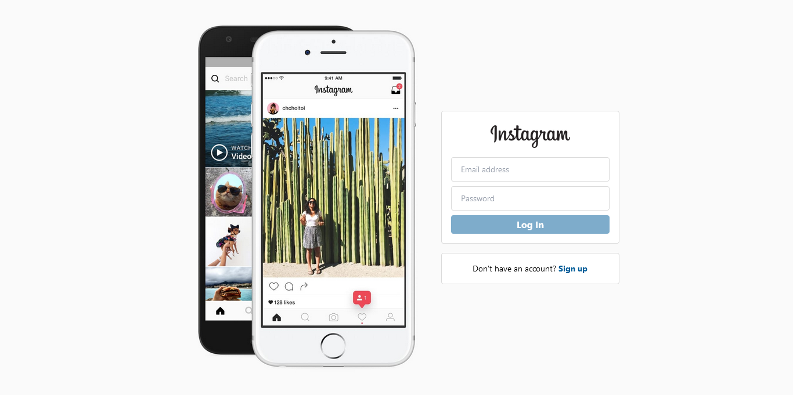
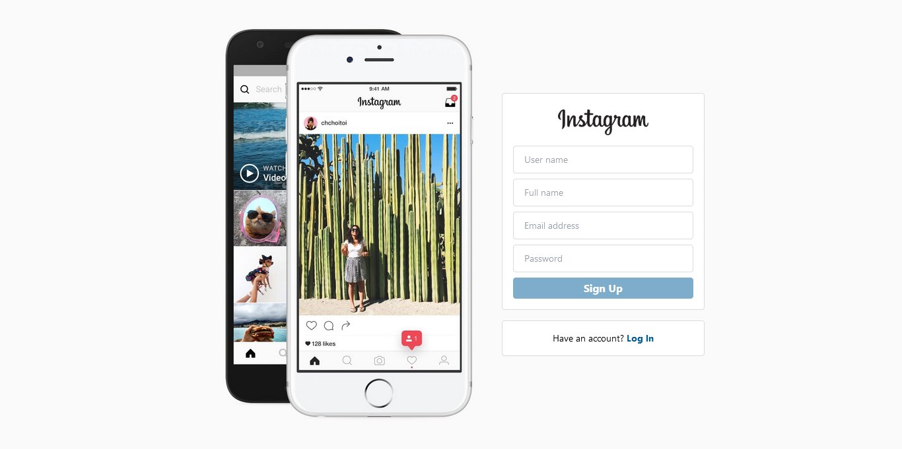
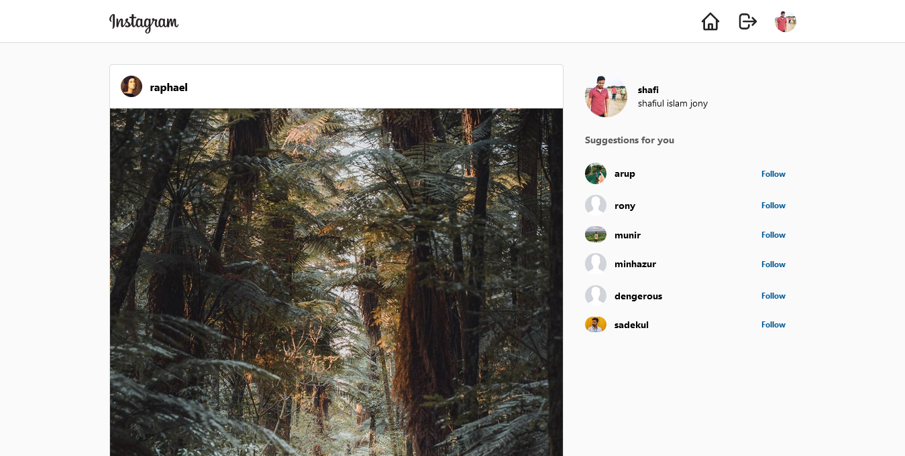
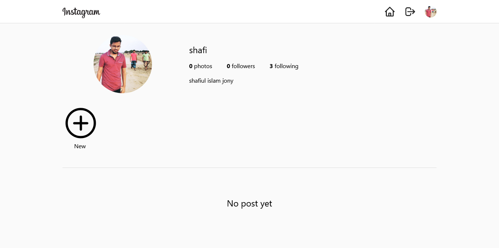
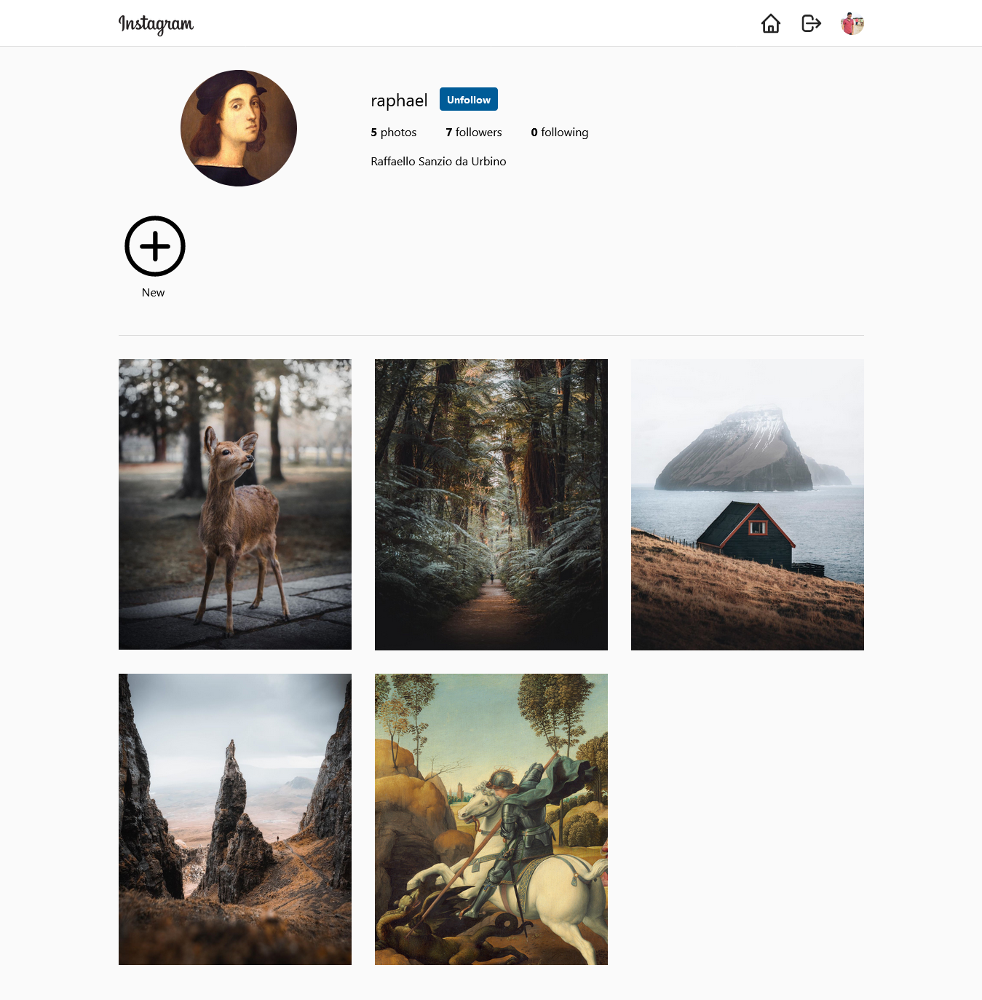

# Instagram Clone Frontend

## Table of contents

- [Core packages](##core-packages)
- [Features](##features)
- [TESTING TOOLS](##testing-tools)
- [UI](##ui)
    -[LOGIN PAGE](###login-page)
    -[SIGN UP](###sign-up)
    -[DASHBOARD](###dashboard)
    -[PROFILE](###profile)
    -[FOLLOWED PROFILE](###followed-profile)

Instagram clone using  React, Firebase.

This is the frontend of Instagram clone, built with React + Firebase. In this project i learn how to use prop-types. Using Devtools like react-dev-tools and lighthous for testing. In future i will make update such as changing avatar and updating profile.

## Core packages

1. React Router - Routing
2. Styling - Tailwind CSS
3. Loading - react-loading-skeleton
4. Date - date-fns
5. Proptypes - prop-types

## Features

1. Login/Signup
2. Follow user
3. Suggested user
4. Showing followed user pictures
5. Like/Dislike photo
6. Add comment
7. Comment Pagination

## TESTING TOOLS

1. Dev tool - Lighthouse

## UI

### LOGIN

### SIGN UP

### DASHBOARD 

### PROFILE

### FOLLOWED PROFILE

